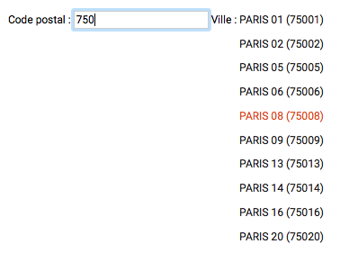

# zip-code-town

This library is an example of `zip-code-town` component.
It was coded for demonstration purpose.

zip-code-town module help to select a town in France from its zip-code.

## Illustration

## Installation

To use it, just clone this repo and install the npm dependencies:

    $ git clone https://github.com/oslo10e/zip-code-town
    $ cd zip-code-town
    $ npm install

## Scripts

All scripts are run with `npm run [script]`, for example: `npm run test`.

* `build` - generate a minified build to dist folder
* `start` - start development server, try it by opening `http://localhost:3000/`
* `test` - run all tests

## zip-code-town component

zip-code-town component attributes : 

| attribute | description | structure |
|---|---|---|
| `zip-code-town` |read-write object structured | `{zipCode: String, town: String}` |

Exemple of integration :

    <zip-code-town zip-code-town="$ctrl.zipCodeTown"></zip-code-town>
    
## zip-code-town service

zip-code-town service that returns zip-code-towns

Exemple of integration :

    zipCodeTownService
      .getList(zipCode)
      .then(zipCodeTowns => {
        this.zipCodeTowns = zipCodeTowns;
      });
    
NB. This service loads text files located in `data/zip-code/`

## Credit

This example uses build process from [NG6-starter](https://github.com/AngularClass/NG6-starter), so check it out for more information if needed.

